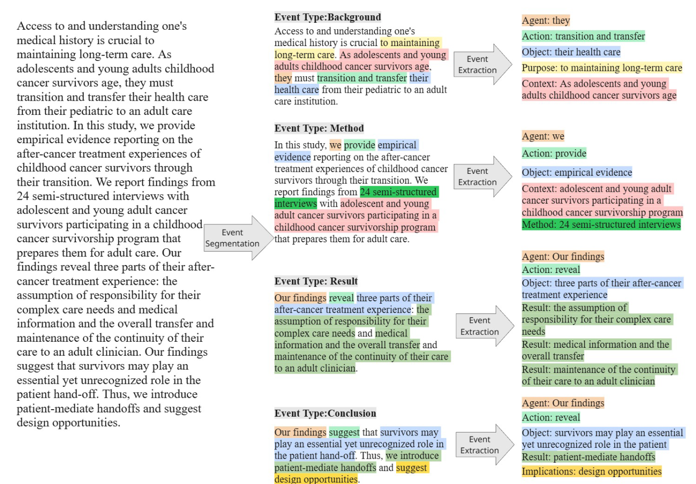

# SciEvent: Benchmarking Multi-domain Scientific Event Extraction (EMNLP-2025)

[Paper link](https://arxiv.org/abs/2509.15620)

<p align="center">
  <br>
  <i>
    Example abstract from 
    <a href="https://dl.acm.org/doi/10.1145/3610201">
      "Plan For Tomorrow: The Experience of Adolescent and Young Adult Childhood Cancer Survivors as they Transition to Adult Care"
    </a> 
    by Ankrah et al., CSCW 2023. Licensed under 
    <a href="https://creativecommons.org/licenses/by/4.0/">CC BY 4.0</a>.
  </i>
</p>

If you find this benchmark and code useful, please cite:

    @inproceedings{
        dong2025scievent,
        title={SciEvent: Benchmarking Multi-domain Scientific Event Extraction},
        author={Bofu Dong and Pritesh Shah and Sumedh Sonawane and Tiyasha Banerjee and Erin Brady and Xinya Du and Ming Jiang},
        booktitle={The 2025 Conference on Empirical Methods in Natural Language Processing},
        year={2025},
        url={https://openreview.net/forum?id=JGyZidxFiC}
    }

Feel free to ask questions at: bofudong@iu.edu

The SciEvent dataset contains 500 scientific abstracts across 5 venues of different domains:
- 100 abstracts from the Association for Computational Linguistics (ACL), Natural Language Processing
- 100 abstracts from the ACM Conference on Computer-Supported Cooperative Work and Social Computing (CSCW), Social Computing
- 100 abstracts from Bioinformatics (BIOINFO), Computational Biology
- 120 abstracts from Digital Humanities Quarterly (DH), Digital Humanities
- 80 abstracts from the Journal of Medical Internet Research (JMIR), Medical Informatics


We provide segementation and annotations in ``SciEvent_data/annotated`` folder. ``SciEvent_data/annotated/event_seg.jsonl`` record the segmentation span; ``SciEvent_data/annotated/event_extraction_finetune_model.jsonl`` and ``SciEvent_data/annotated/event_extraction_LLM.jsonl`` are the event extraction annotations, which include the trigger, argument span and event segmentation type. These two are same in annotation, but made for different kind of baselines to enable easier implementation.

We also provide raw abstracts that are invovled in the experiments we used (except for CSCW's, due to license limitation), they are in ``SciEvent_data/abstract_texts`` folder. Each of their file name match the "doc_id" in the annotations above.

# Data Attribution:
We give attribution to all abstracts that contribute to building this work in the ``SciEvent_data/metadata/SciEvent_metadata.csv`` file. We acknolwedge the titles, authors, doi (if applicable), url and license.

Please note, for all following baseline models and LLMs, we cannot provide abstracts for CSCW due to license limitations, and if you want to reproduce exact results as the paper, please prepare these abstracts yourself. We highly recommend download these abstracts.

# Tuning-Based Models:
Our chosen tuning-based baselines are [DEGREE](https://github.com/PlusLabNLP/DEGREE/tree/master), [OneIE's](https://blender.cs.illinois.edu/software/oneie/) and [EEQA's](https://github.com/xinyadu/eeqa/tree/master), which represented the state-of-the-art event extraction models at the time of this work. We adapt from [DEGREE's E2E (End2end)](https://github.com/PlusLabNLP/DEGREE/tree/master), [OneIE's](https://blender.cs.illinois.edu/software/oneie/) and [EEQA's](https://github.com/xinyadu/eeqa/tree/master) training and evaluation procedures with modifications. We deeply thank the contribution from the authors of these papers.

The following code assume your path at the Repository's root ```./SciEvent```

## [DEGREE](https://github.com/PlusLabNLP/DEGREE/tree/master)

Setup virtual env: ```conda env create -f degree.yml```

### Data Preprocessing

Please follow these code to preprocess SciEvent data for DEGREE format:

```bash
bash data_scripts/shared/prepare_data.sh
# By default output "all_data.json" will be save at SciEvent_data/DEGREE/processed

# Split "all_data.json" for training, validation and testing
python data_scripts/shared/split_data.py
# Default output directory at SciEvent_data/DEGREE/all_splits
# Output names will be "train.json", "dev.json", and "test.json".
```

### Training

Use following commands for training DEGREE on SciEvent data:

Generate data for DEGREE
```bash
python baselines/DEGREE/degree/generate_data_degree_scievent.py -c baselines/DEGREE/config/config_degree_scievent.json
```

Train DEGREE
```bash
python baselines/DEGREE/degree/train_degree_scievent.py -c baselines/DEGREE/config/config_degree_scievent.json
```

The model will be stored at ```baselines/DEGREE/output/degree_e2e_scievent/full_data/[timestamp]/best_model.mdl``` in default.

If the loading of model errors, please make sure that ``use_cdn = False`` in the ``envs/DEGREE/lib/python3.8/site-packages/transformers/modeling_utils.py`` file. This will use back-up source to load model, since the cdn is no longer supported by HuggingFace. You will need to do the same for OneIE or EEQA environment if you experience same issue for their training.

### Evaluations
Evaluate with following code:
```bash
python baselines/DEGREE/degree/eval_scievent.py -c baselines/DEGREE/config/config_degree_scievent.json -e [path_to_your_mdl]
```

## [OneIE](https://blender.cs.illinois.edu/software/oneie/)

Setup virtual env: ```conda env create -f oneie.yml```

### Data Preprocessing
Please follow these code to preprocess SciEvent data for ONEIE format:

OneIE and DEGREE share similar input structure, we only need to rename ```wnd_id``` into ```sent_id```. Following will prepare all split and ablated training data.
```bash
bash data_scripts/ONEIE/wnd_id_rename.sh
```

### Training
Use following for training
```bash
python baselines/ONEIE/train.py -c baselines/ONEIE/config/config_oneie_scievent.json
```

### Evaluations
Full data:
```bash
python baselines/ONEIE/json_to_txt_for_pred.py --input_jsonl baselines/ONEIE/output/scievent/full_data/[model_timestamp]/result.test.json --output_dir baselines/ONEIE/txt/full_data
python baselines/ONEIE/predict.py -m baselines/ONEIE/output/scievent/full_data/[model_timestamp]/best.role.mdl -i baselines/ONEIE/txt/full_data -o baselines/ONEIE/output_json/full_data --format txt
python baselines/ONEIE/convert_oneie_to_degree_json.py --pred_dir baselines/ONEIE/output_json/full_data --output_file baselines/ONEIE/eval_data/full_data/oneie_preds_degree_format.json
python baselines/ONEIE/EM_overlap_eval.py --pred baselines/ONEIE/eval_data/full_data/oneie_preds_degree_format.json --gold SciEvent_data/ONEIE/all_splits/test.oneie.json
```

## [EEQA](https://github.com/xinyadu/eeqa/tree/master)

Setup virtual env: ```conda env create -f eeqa.yml```


### Data Preprocessing
Please follow these code to preprocess SciEvent data for ONEIE format:

We are also using DEGREE format and convert them into EEQA input format, splits and ablation data will be saved to ```SciEvent_data/EEQA``` in default

```bash
bash data_scripts/EEQA/convert_to_eeqa.sh
```

### Train and evaluate models

**Trigger Detection:**

```bash
bash baselines/EEQA/code/script_trigger_qa.sh
```

Default output path: ```baselines/EEQA/scievent_trigger_qa_output/full_data```

**Argument Extraction:**

SciEvent uses the best performing template and setting reported by EEQA and after preliminary experiment. 

Full data With dynamic threshold:
  
```bash
bash baselines/EEQA/code/script_args_qa_thresh.sh
```

Default output path: ```baselines/EEQA/scievent_args_qa_thresh_output/full_data```

### Evaluations

```bash
python baselines/EEQA/scievent_eval/prepare_for_eval.py \
  -arg_raw baselines/EEQA/scievent_args_qa_thresh_output/full_data/best_args/arg_predictions.json \
  -trig_pred baselines/EEQA/scievent_trigger_qa_output/full_data/best/trigger_predictions.json \
  -gold SciEvent_data/EEQA/all_splits/test.eeqa.json \
  -final_out baselines/EEQA/scievent_eval/full_data/arg_predictions_final.json

python baselines/EEQA/scievent_eval/EM_overlap_eval.py --pred baselines/EEQA/scievent_eval/full_data/arg_predictions_final.json --gold SciEvent_data/EEQA/all_splits/test.eeqa.json
```


# LLM Prompts
We provide our prompt templates in ```baselines/LLM/prompts```. Using the abstract texts and these templates, you can evaluate LLMs on provided and downloded abstracts.

# Annoation Tool
Our annotation tool is available at ``https://smalldemo.onrender.com/``, and the source code is open at ``https://github.com/priteshshah96/smalldemo``. A JSON example for annotation using the tool can be found in the directory ``SciEvent_data/unannotated_example``